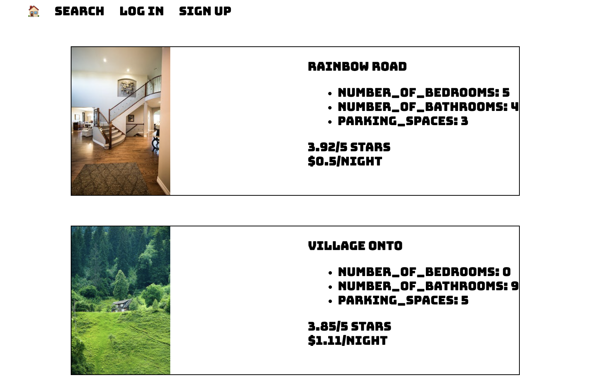
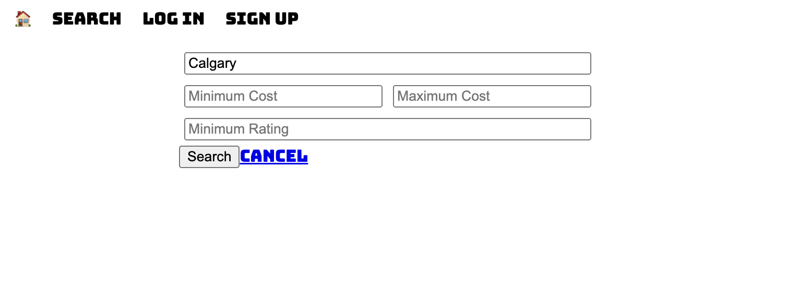
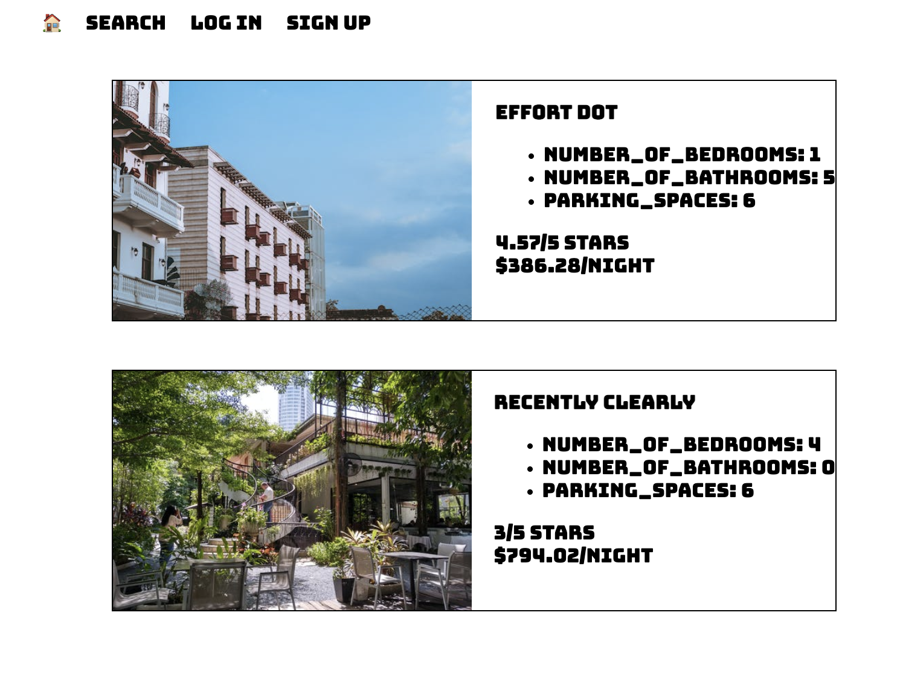

# LightBnB

## Description

This project integrates a database into the backend to create a simple fullstack application mimicing some of AirBnB's functionality. 

## Screenshots

Home Page


Filtering Searches


Filtering Results


Log In to Access Reservations History


## Getting Started

### Adding the initial Database
- launch PostgreSQL ex. psql in terminal
- run: CREATE DATABASE lightbnb;
- run: \c lightbnb;
- run: \i database_init/migrations/01_schema.sql;
- run: \i database_init/seeds/01_seeds.sql;
- run: \i database_init/seeds/02_seeds.sql;

### Starting server
- Install all dependencies (using the `npm install` command).
- Navigate into correct directory using the `cd LightBnB_WebApp-master` command.
- Run  `npm run local`
- navigate into the  browser and type in `localhost:3000` to visit the webpage


## Dependencies

- pg - Postgress Javascript library
- nodemon
- express
- cookie-session
- body-parser
- bcrypt

## Project Structure

```
├── public
│   ├── index.html
│   ├── javascript
│   │   ├── components 
│   │   │   ├── header.js
│   │   │   ├── login_form.js
│   │   │   ├── new_property_form.js
│   │   │   ├── property_listing.js
│   │   │   ├── property_listings.js
│   │   │   ├── search_form.js
│   │   │   └── signup_form.js
│   │   ├── index.js
│   │   ├── libraries
│   │   ├── network.js
│   │   └── views_manager.js
│   └── styles
├── sass
├── server
|    ├── apiRoutes.js
|    ├── database.js
|    ├── json
|    ├── server.js
|    └── userRoutes.js
|
|
├── database_initialization
|    ├── 1_queries
|    |   ├── 1_questions.sql
|    |   ├── 2_averageDuration.sql
|    |   ├── 3_listingsByCity.sql
|    |   ├── 4_mostVisitedCities
|    |   └── 5_AllMyReservations.sql
|    |
|    ├── migrations
|    |   └── 01_schema.sql
|    |
|    └── seeds
|        ├── 01_seeds.sql
|        └── 02_seeds.sql
|
└──resources
    └──images
```

* `public` contains all of the HTML, CSS, and client side JavaScript. 
  * `index.html` is the entry point to the application. It's the only html page because this is a single page application.
  * `javascript` contains all of the client side javascript files.
    * `index.js` starts up the application by rendering the listings.
    * `network.js` manages all ajax requests to the server.
    * `views_manager.js` manages which components appear on screen.
    * `components` contains all of the individual html components. They are all created using jQuery.
* `sass` contains all of the sass files. 
* `server` contains all of the server side and database code.
  * `server.js` is the entry point to the application. This connects the routes to the database.
  * `apiRoutes.js` and `userRoutes.js` are responsible for any HTTP requests to `/users/something` or `/api/something`. 
  * `json` is a directory that contains a bunch of dummy data in `.json` files.
  * `database.js` is responsible for all queries to the database. It doesn't currently connect to any database, all it does is return data from `.json` files.